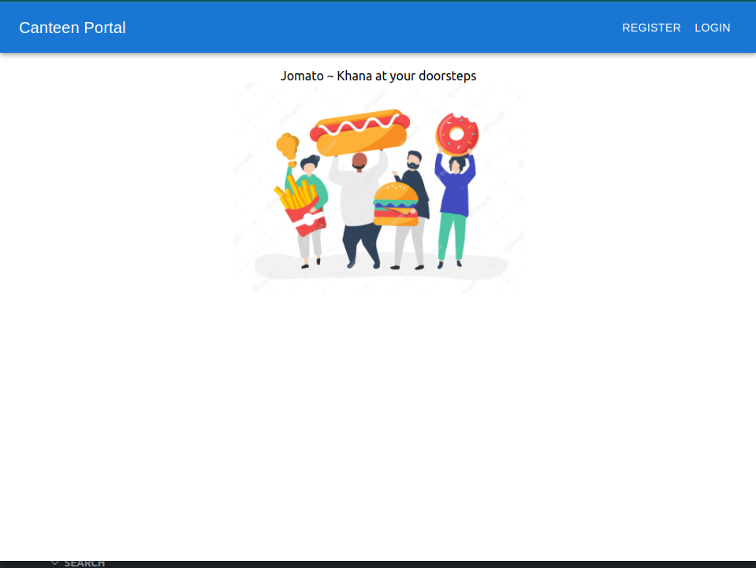

# JOMATO WEB-PORTAL 

### A Food Ordering Website built using MERN stack .
  
 
 
 ### Key Features : 
 
 1. Implemented **email** alert system using `email.js` that sends an email confirmation to the buyer , on acceptance/rejection of food order from the vendor.
 2. Implemented **Fuzzy Search** using `fuse.js` library , for the buyer side to search for food items and place an order accordingly.
 3. Implemented sorting of the food item list for the buyer : 
     1. Veg/Non-Veg tag selection : Filter foods based on veg, non-veg food type
     2. Tags : Filter foods by adding multiple tags 
     3. Shop Name : Filter the food items using shop names 
     4. Price range :; Filtering the food items based on min and max price range of values
 4. Implemented `Favorites` option , for the user to add and remove ( a checkbox ) favorite food items  from various vendors .
 5. Implemented **Sorting** of food items based on price and ratings.
 6. Implemented **Rate** food order , once the order is completed , the buyer could rate the food item , and the rating gets updated on the site.
 7. Implemented feature to add multiple tags and food add-ons , for the vendor while adding a food item for display.
 8.Implemented **Shop Timing**  feature , wherein the shops that is closed at the time of food ordering appear at the bottom of the list and grayed-out , to mark them as unavailable for ordering.

 
